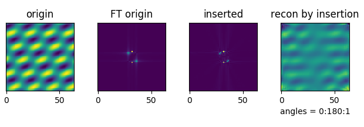
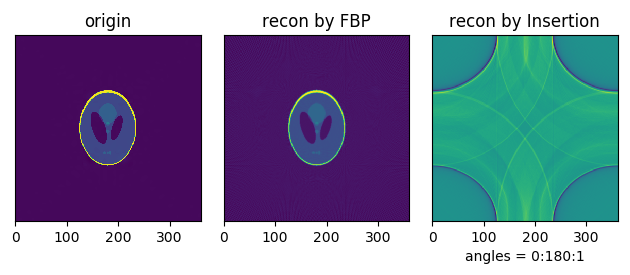
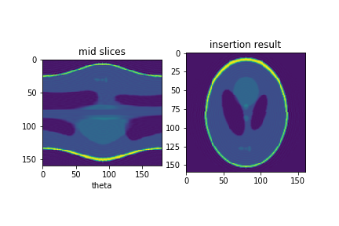

## Reconstruction Problems

I tried two methods:
1. insert Fourier slices (complex nus) into a 3D (2D) blank model, then iFFT (Insertion).
2. Standard filtered back projection (FBP).

### Problem
The second method works well. The first one cannot generate a correct model in real space, although it seems correct in Fourier space.

### Image examples
Several 2D examples are shown below.
#### 1. Reconstruction of a simple image by Insertion

The Fourier space seems to be evaluated properly (although interpolation errors), but the real space is far from the original one.

But at the same angluar seperation, FBP works well, especially when padded.

#### 2. Shepp-Logan Phantom test

As can be seen, after padded, FBP can reconstruct the image better than unpadded. Insertion seems "wrapped".

#### 3. Test for insertion algorithm

To confirm the correctness of the slice-insertion program, the middle slices of the phantom is taken directly at different orientations, and inserted back to get the original image.

### Details 
1. A filter (ramp, |k|) is used in FBP, but not in Insertion. Because by interpolation, the values are averaged by normalized weights.
2. Image center: dx//2, dy//2. Coordinate system: consistent with array index system.
3. fftshift before showing Fourier images. But ifftshift before ifft.

